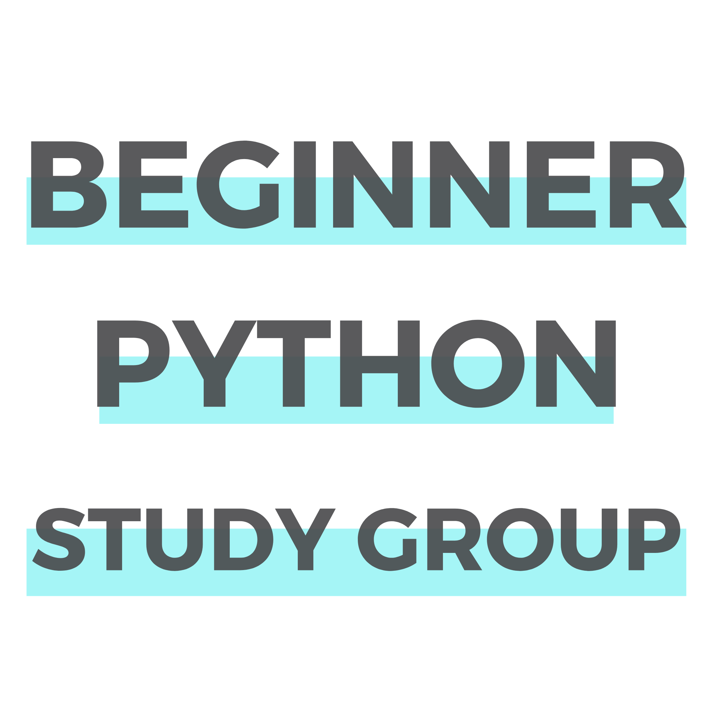

<h2 align="center" margin-bottom="0"><b>Beginner Python Study Group</b></h3>
<h3 align="center" margin-top="0">by WomenWhoCode Python</h3>

Join us every other Wednesday at 5PM PDT/8PM EDT  as we journey through the exciting world of Python libraries, data types, programming logic and useful functions, and modules with real-time coding exercises. Grab a cup of tea (or your favorite drink) and code along with us!

*Session materials will be updated 1-2 days prior to the Study Group.*  

*The Study Group will be using [google colab notebook](https://colab.research.google.com/notebooks/intro.ipynb) hence no python installation is required. If you wish to download Python on your local computer, click [here](https://www.python.org/downloads/).*  

*New Google Colab? Check out our [Colab FAQ](https://drive.google.com/file/d/1_Etoo2NaiKusJvavcSpxXrC5ppmm3pTU/view?usp=sharing) to get yourself ready!*
##

## **Session Materials**  

**Session 1 (Aug 26) Introduction to Python** -
[Access slides](https://drive.google.com/file/d/1-xtnjLtA5wTMwt9owI-nwlfCz75PjLuD/view?usp=sharing)  

**Session 2 (Sep 9) Python Libraries** -   
[Access slides](https://drive.google.com/file/d/1yLVlix913I20GzTBiET4Nqfree5keMy6/view?usp=sharing)  
[Access colab notebook](https://colab.research.google.com/github/nuageklow/WWCodePython_BeginnerSeries/blob/master/Ses02_WWCode_BeginnerPythonStudyGroup_PythonLibrary.ipynb)  

**Session 3 (Sep 23) Data Types (Part 1)**  -  
[Access slides](https://drive.google.com/file/d/1yEnzUYqfjGm4CPqW9rA35XFjFNWOvz_f/view?usp=sharing)  
[Access colab notebook](https://colab.research.google.com/github/nuageklow/WWCodePython_BeginnerSeries/blob/master/Ses03_WWCode_Python_Beginner_Study_Series.ipynb)

## **Reference Resources**  
**Introduction to Python / Colab**
* [Google colab notebook](https://colab.research.google.com/github/googlecolab/colabtools/blob/master/notebooks/colab-github-demo.ipynb)  
* [Github / colab / drive](https://towardsdatascience.com/google-drive-google-colab-github-dont-just-read-do-it-5554d5824228)  
* [Python Applications and Uses](https://www.upgrad.com/blog/python-applications-in-real-world)  

**Python Libraries**  
* [pip install](https://datatofish.com/install-package-python-using-pip/)  
* [How to use Python libraries](https://note.nkmk.me/en/python-package-version/)
* [Python Modules](https://docs.python.org/3/tutorial/modules.html)    

**Data Types**
* [Python data types (W3 School)](https://www.w3schools.com/python/python_datatypes.asp)  
* [Python data type (Real Python)](https://realpython.com/python-data-types/)  
* [Basic types (Numpy)](https://numpy.org/doc/stable/user/basics.types.html)  
* [Automate the Boring Stuff with Python - Chapter 1](https://automatetheboringstuff.com/2e/chapter1/)  
* [Python Crash Course by Eric Matthes- Chapter 2](https://nostarch.com/download/samples/PythonCrashCourse2E_Sample_Ch2.pdf)

##   

Wanna ask us a question? Join us on [slack](https://join.slack.com/t/wwcodepython/shared_invite/zt-grsrjbk1-VwhxaVzjkpDokwgYHkYkqA)!
